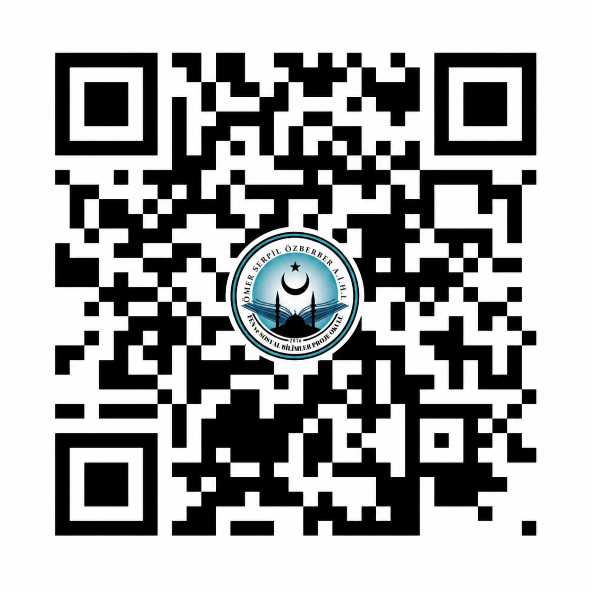

# Dijital Çağda Değer Erozyonu

**Gençlerin Sosyal Mecrada Dini ve Ahlaki Değerlere Yaklaşımı**

T.C. Millî Eğitim Bakanlığı Ömer-Serpil Özberber AİHL Fen ve Sosyal Bilimler Proje Okulu 12. Dönem TÜBİTAK 4006-A Bilim Fuarı Proje Sergisi

QR kodu **okutarak** veya QR koda **tıklayarak** uygulamaya hızlıca erişebilirsiniz:

<table>
  <tr>
    <td align="center">
      
       
      <b>GitHub Pages</b>
    </td>
    <td align="center">
      
       
      <b>Cloudflare Pages</b>
    </td>
  </tr>
</table>

## Proje Bilgileri

| Alan | Bilgi |
| --- | --- |
| Proje Türü | Araştırma |
| Ana Alanı | Sosyoloji |
| Tematik Konusu | Değerler Eğitimi |

## Problem / Soru Cümlesi

*Sosyal medya kullanımı, lise öğrencilerinin dini ve ahlaki değerlere yönelik tutum ve davranışlarını nasıl etkilemektedir?*

## Özet

Lise öğrencilerinin sosyal medyada dini ve ahlaki değerlere yönelik tutumları, farkındalık düzeyleri ve davranış biçimleri incelenmiştir. Sosyal medya, gençlerin düşünce ve davranış biçimlerini, dini ve ahlaki değer algılarını doğrudan etkileyebilmektedir. Bu proje, gençlerin dijital ortamda değerlerini nasıl koruduklarını ya da yitirdiklerini analiz ederek farkındalık oluşturmayı amaçlamaktadır.

## Yöntem

Bu araştırma, nicel ve nitel verilerin birlikte kullanıldığı **karma yöntem yaklaşımına dayalı betimsel tarama modeli** ile gerçekleştirilmiştir.

Çalışma grubu 9-12. sınıflardan gönüllü 50 öğrenciden oluşmaktadır. Öğrencilere anket uygulanmış, ardından gönüllü öğrencilerle odak grup görüşmeleri gerçekleştirilmiştir. Tüm veriler anonim olarak toplanmıştır.

## Bulgular

Pano üzerinde yer alan bulgular ve sütun grafikleri aşağıda sunulmuştur:

## Sonuç ve Tartışma

Araştırma sonucunda, sosyal medya kullanımının öğrencilerin dini ve ahlaki değer algıları üzerinde etkili olduğu belirlenmiştir. Özellikle uzun süreli sosyal medya kullanımı, bazı değerlerde, özellikle dini duyarlılık ve dijital nezaket alanlarında zayıflamaya yol açabilmektedir.

**Elde edilen bulgular, sosyal medyanın gençlerin değer dünyasını hem olumlu hem de olumsuz yönde etkileyebildiğini göstermektedir.** Sosyal medya bilgiye erişim ve farkındalık oluşturma açısından fırsatlar sunarken, aynı zamanda değerlerin yüzeyselleşmesine ve bazı alanlarda zayıflamasına neden olabilmektedir.

## Kaynaklar

- MEB (2024). *Değerler Eğitimi Rehberi*.
- Yılmaz, H. (2022). *Dijital Çağda Gençlik ve Değerler*.
- Arıkan, R. (2020). *Sosyal Medya ve Gençlerin Dini Algısı Üzerine Bir İnceleme*.
